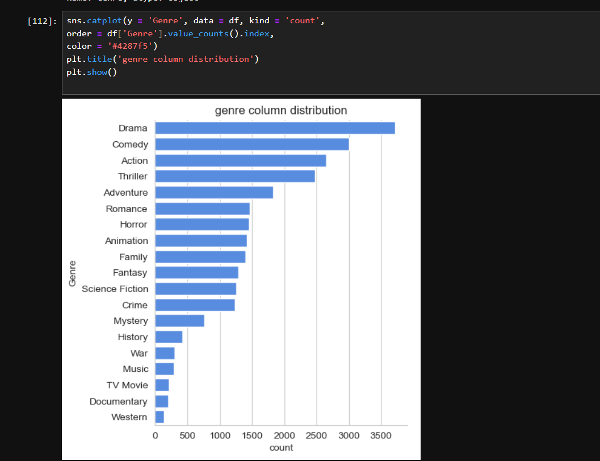
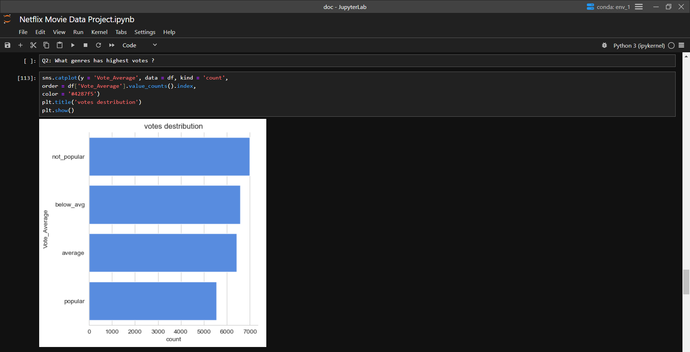

# 🎬 Netflix Data Analysis using Python

## 📌 Project Overview

This project analyzes Netflix movie data using Python, Pandas, Matplotlib, and Seaborn to identify trends in genres, vote distribution, popularity, and other key insights.

## 🛠 Technologies Used

- Python
- Pandas
- NumPy
- Matplotlib
- Seaborn
- Jupyter Notebook

## 📊 Key Analysis

- Genre distribution
- Vote distribution
- Vote average analysis
- Popularity analysis
- Missing value handling
- Exploratory Data Analysis (EDA)

## 📷 Project Screenshots

### Genre Distribution



### Vote Distribution



## 🚀 How to Run

```bash
pip install -r requirements.txt
jupyter notebook
```

## 📁 Project Structure

```
Netflix-Data-Analysis/
│── Netflix_Data_Analysis.ipynb
│── netflix_titles.csv
│── requirements.txt
│── README.md
│── genre_distribution.png
│── votes_distribution.png
```

## 👤 Author

Anubhav Chhatriya
MBA (E-Commerce)
